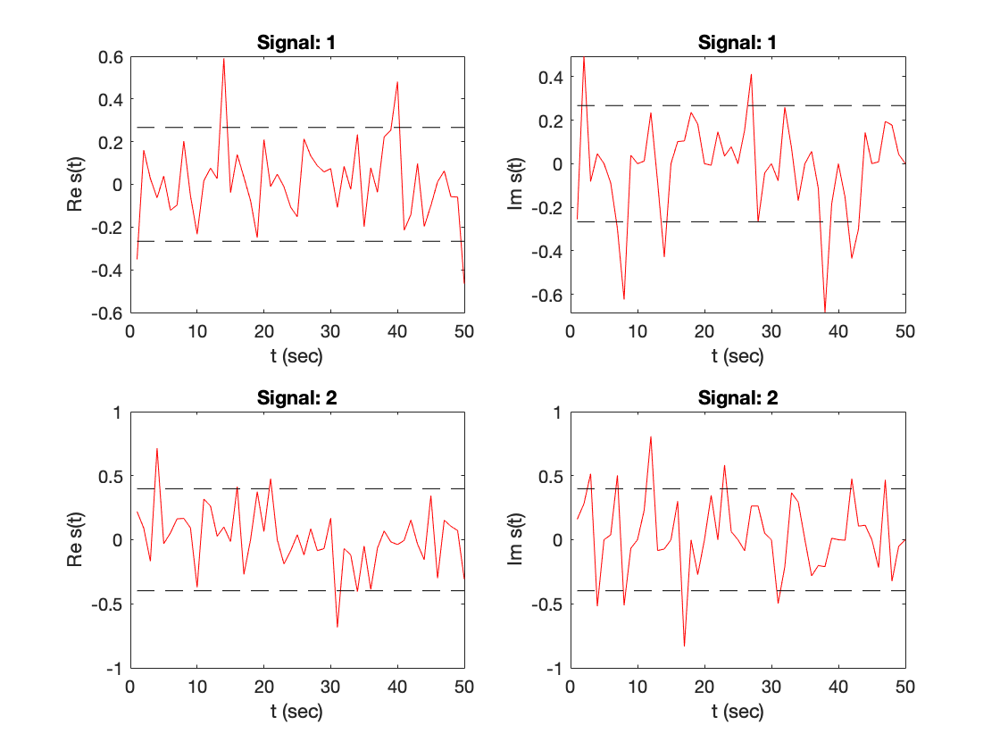
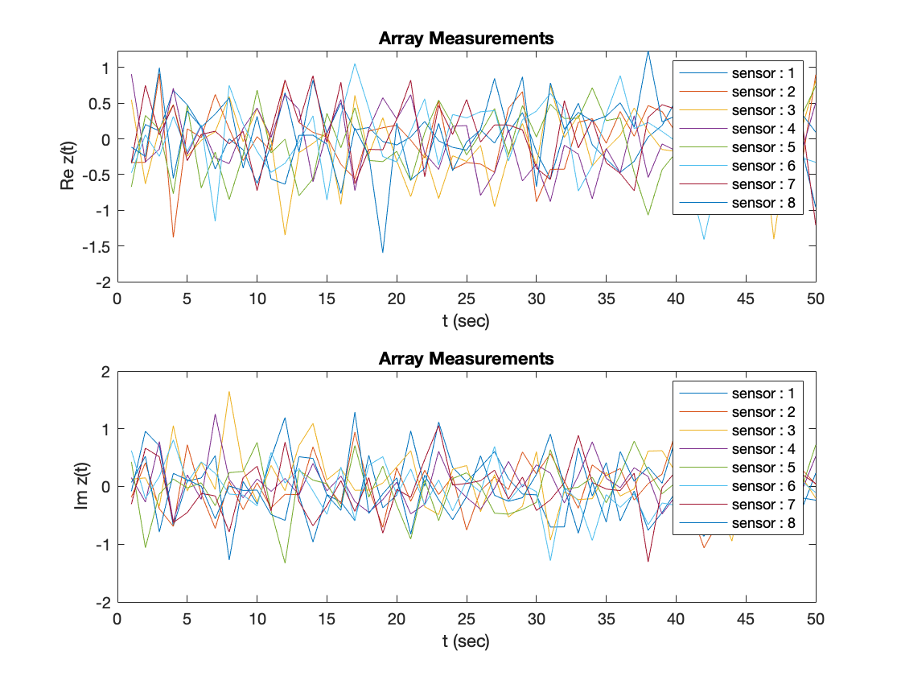
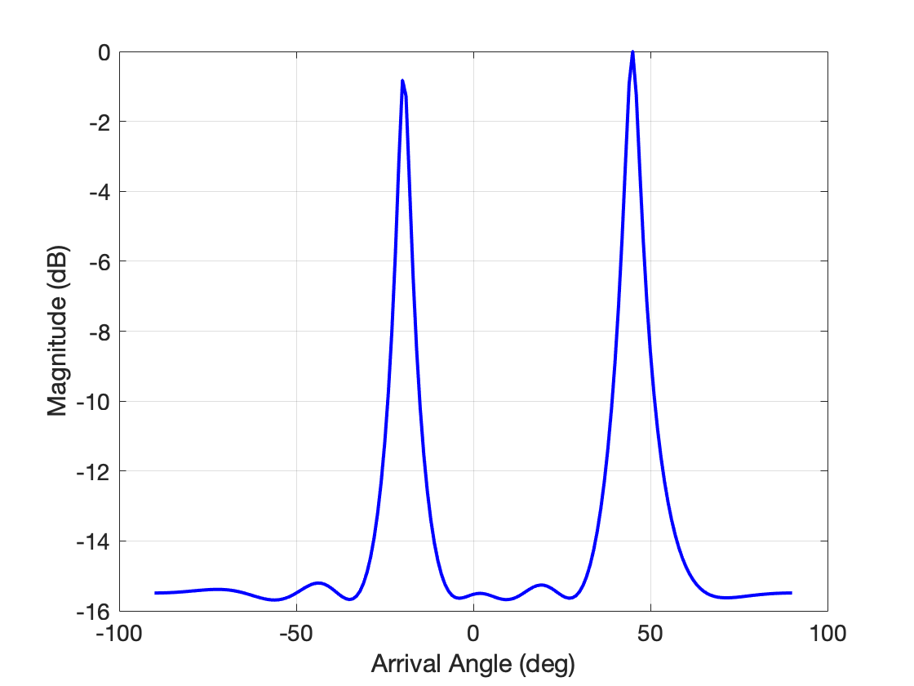

# signal-fundamentals
Useful Matlab scripts and Python notebooks for future references :)


### Direction of arrival (DOA) estimation using MUSIC algorithm 
The Matlab script generates signal samples, sensor array measurements and perfrom direction of arrival (DOA) estimation using MUSIC algorithm. 
```
DOA_MUSIC.m
```
<p align="center">
 
 
 
</p>

**References:**  
[1]. Schmidt, Ralph. "Multiple emitter location and signal parameter estimation." IEEE transactions on antennas and propagation 34.3 (1986): 276-280.
